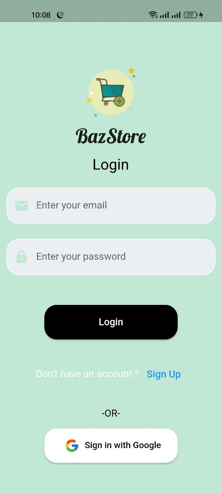
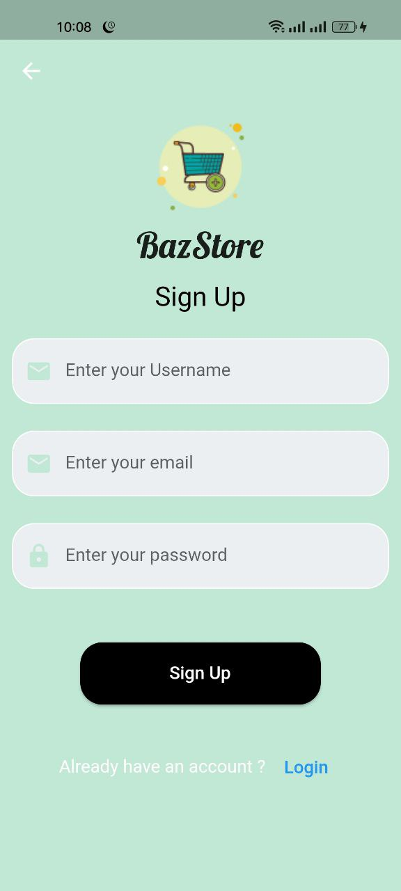
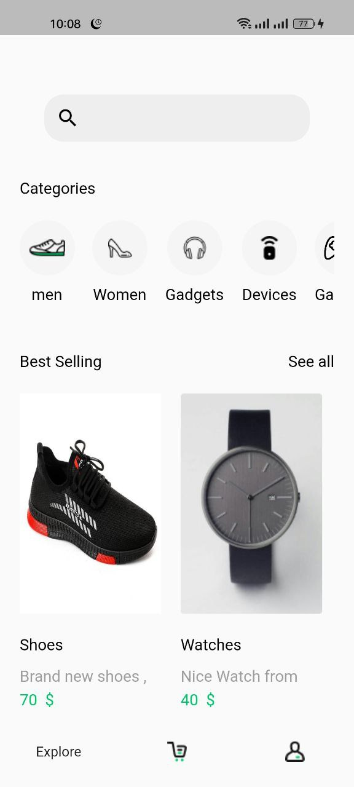
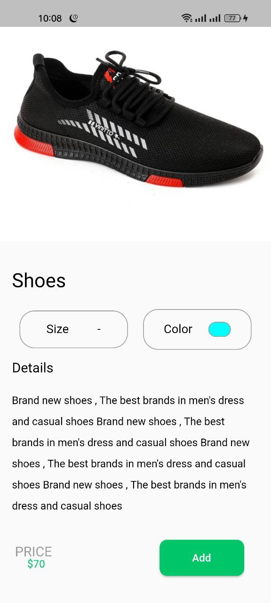
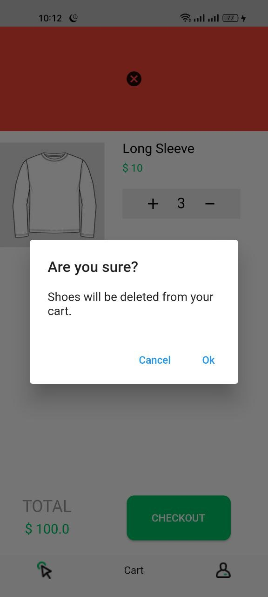
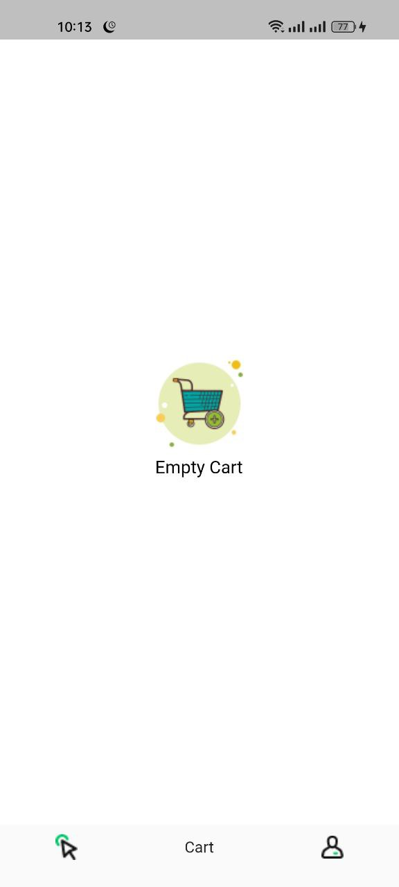
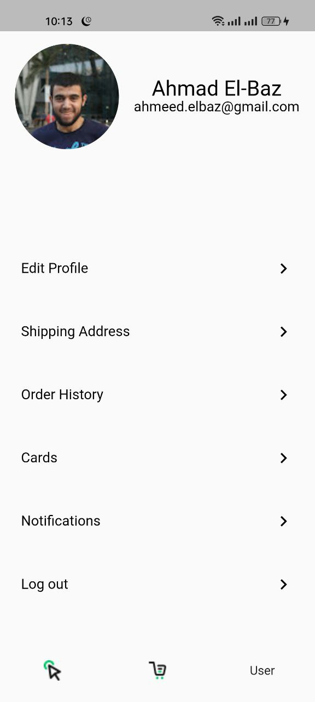

# BazStore

E-commerce Flutter app using GetX, MVVM, firestore, firebase authentication and many other features.

## Details

In this project we created E-commerce app useing Flutter & Dart

- GetX State management & routing system
- MVVM architecture pattern
- Firestore as Backend
- Sqflite & shared preference for local database
- Firebase storage for images
- Beautiful UI 

## Screenshots

## Notes

- This UI design does not belong to me, but i wrote it all from scratch and added some changes.
- The app is functional as i wanted to practice and apply my knowledge.
- The app is incomplete, i think its enough for what i wanted to achieve.